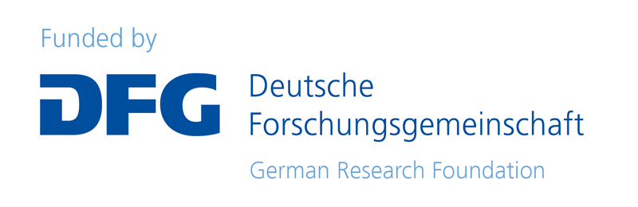

<!-- README.md is generated from README.Rmd. Please edit that file -->
<!-- badges: start -->

<!-- badges: end -->

# GlobaLID App 

Here you can find the source code of the GlobaLID web app.

# What is GlobaLID?

GlobaLID is a Global Lead Isotope Database and aims to facilitate the
reconstruction of raw material provenances with lead isotopes,
especially in archaeology. The app provides direct access to and
convenient interaction with the [GlobaLID
database](https://doi.org/10.5880/fidgeo.2023.043). You can filter the
database according to your research question, upload own data to compare
it with GlobaLID, and produce and download publication ready plots.
Watch our [video tutorial](https://www.youtube.com/watch?v=qwKStMc-068)
to learn more! Visit [our
webpage](https://archmetaldbm.github.io/Globalid/) to learn more about
the GlobaLID project and to get the latest news.

The current version of the GlobaLID database includes data from these
locations: 

# How to cite

If you use the GlobaLID app, please cite it as:

- GlobaLID Core Team. (2021). GlobaLID web application V. 1.0, database
  status: 2023-11-19. <https://globalid.dmt-lb.de/>
- Klein, S., Rose, T., Westner, K. J., & Hsu, Y.-K. (2022). From OXALID
  to GlobaLID: Introducing a modern and FAIR lead isotope database with
  an interactive application. Archaeometry 64(4), 935–950.
  <https://doi.org/10.1111/arcm.12762>

<!-- -->

    @misc{GlobaLIDCoreTeam.2022,
     author = {{GlobaLID Core Team}},
     year = {2022},
     title = {{GlobaLID web application V. 1.0, database status: 2023-11-19}},
     url = {https://globalid.dmt-lb.de/}
    }

    @article{Klein.2022,
    author = {Klein, Sabine and Rose, Thomas and Westner, Katrin J. and Hsu, Yiu-Kang},
    title = {From OXALID to GlobaLID: Introducing a modern and FAIR lead isotope database with an interactive application},
    journal = {Archaeometry},
    volume = {64},
    number = {4},
    pages = {935-950},
    doi = {https://doi.org/10.1111/arcm.12762},
    }

# Join the team!

GlobaLID needs your help to grow and to provide high quality datasets!
The core team is permanently reviewing and adding new and old data from
the literature to keep GlobaLID growing. However, we are neither
proficient enough with the geology and geography of all parts of the
world nor do we know all publications with lead isotope data from ores
and minerals. Hence we are happy about any support from our community.
Interested? Write us!

# Team

## Project team

- [Sabine
  Klein](https://www.bergbaumuseum.de/en/museum/mitarbeitende/kontakt-detailseite/prof-dr-sabine-klein)
  
  (Forschungsbereich Archäometallurgie, Leibniz-Forschungsmuseum für
  Georessourcen/Deutsches Bergbau-Museum Bochum, Bochum, Germany;
  Institut für Archäologische Wissenschaften, Ruhr-Universität Bochum,
  Bochum, Germany; FIERCE, Frankfurt Isotope & Element Research Centre,
  Goethe Universität, Frankfurt am Main, Germany)
- Helge Wiethoff (Rechenzentrum, Technische Hochschule Georg Agricola,
  Bochum, Germany)
- [Thomas Rose](https://copper-smelting.com/)
  
  (Forschungsbereich Archäometallurgie, Leibniz-Forschungsmuseum für
  Georessourcen/Deutsches Bergbau-Museum Bochum, Bochum, Germany)
- [Tim
  Greifelt](https://www.bergbaumuseum.de/museum/mitarbeitende/kontakt-detailseite/tim-greifelt)
  (Forschungsbereich Archäometallurgie, Leibniz-Forschungsmuseum für
  Georessourcen/Deutsches Bergbau-Museum Bochum, Bochum, Germany)
- [Katrin J.
  Westner](https://www.bergbaumuseum.de/museum/mitarbeitende/kontakt-detailseite/dr-katrin-julia-westner)
  
  (Forschungsbereich Archäometallurgie, Leibniz-Forschungsmuseum für
  Georessourcen/Deutsches Bergbau-Museum Bochum, Bochum, Germany)
- [Yiu-Kang
  Hsu](https://www.bergbaumuseum.de/en/museum/mitarbeitende/kontakt-detailseite/yiu-kang-hsu)
  
  (Forschungsbereich Archäometallurgie, Leibniz-Forschungsmuseum für
  Georessourcen/Deutsches Bergbau-Museum Bochum, Bochum, Germany)
- [Annette
  Hornschuch](https://www.bergbaumuseum.de/museum/mitarbeitende/kontakt-detailseite/annette-hornschuch)
  (Forschungsbereich Montanarchäologie, Leibniz-Forschungsmuseum für
  Georessourcen/Deutsches Bergbau-Museum Bochum, Bochum, Germany)

## Regional editors

- Southeast Asia: [T. O.
  Pryce](https://iramat.cnrs.fr/user/oliver.pryce/)
  
  (Centre National de la Recherche Scientifique, UMR 7065 Institut de
  Recherche sur les ArchéoMATériaux, Université Paris-Saclay & CEA/CNRS
  UMR 3685 NIMBE, 91191 Gif-sur-Yvette, France)
- Africa: [Jay Stephens](https://archaeometry.missouri.edu/staff.html)
  
  (School of Anthropology, University of Arizona, Tucson, AZ, USA;
  Archaeometry Laboratory, Research Reactor Center, University of
  Missouri, Columbia, MO, USA)
- Iran: [Nima
  Nezafati](https://www.bergbaumuseum.de/en/museum/mitarbeitende/kontakt-detailseite/dr-nima-nezafati)
  
  (Forschungsbereich Archäometallurgie, Leibniz-Forschungsmuseum für
  Georessourcen/Deutsches Bergbau-Museum Bochum, Bochum, Germany)
- North America:
  - [Virginie
    Renson](https://archaeometry.missouri.edu/profile(Virginie).html)
    
    (Archaeometry Laboratory, Research Reactor Center, University of
    Missouri, Columbia, MO, USA)
  - [David
    Killick](https://anthropology.arizona.edu/people/dave-killick)
    
    (School of Anthropology, University of Arizona, Tucson, AZ, USA)
- South America: [María Florencia
  Becerra](https://www.conicet.gov.ar/new_scp/detalle.php?id=29835)
  
  (CONICET (Consejo Nacional de Investigaciones Científicas y
  Técnicas) - División Arqueología, Museo de La Plata, Facultad de
  Ciencias Naturales y Museo, Universidad Nacional de La Plata,
  Argentina)

## Contributors (Data)

- Sabine Fischer-Lechner (Forschungsbereich Archäometallurgie,
  Leibniz-Forschungsmuseum für Georessourcen/Deutsches Bergbau-Museum
  Bochum, Bochum, Germany)

# Funding

<table width="100%" cellspacing="0" cellpadding="0" border="0">
<tbody>
<tr>
<td>

</td>
<td halign="left">
This work has received funding from the German Research Foundation (DFG)
through the grants KL 1259/17-1 and WI 5923/2-1 (project number:
524790825).
</td>
</tr>
</tbody>
</table>

# Acknowledgements

The initial GlobaLID database was compiled during years of own research
and profited from the generous sharing of published lead isotope
datasets by many colleagues. The creative and collective work of
compiling the database and application was initiated when all members of
the Core Team and E. Salzmann were members of the Archaeometallurgy
group at the Deutsches Bergbau-Museum Bochum (DBM). H. Zietsch (DBM)
compiled the initial literature references.

The Core Team feels deeply grateful for the support of the contributors.
Without their efforts, GlobaLID would grow much slower and less
accurate.

We are indebted to the R Core Team for providing and maintaining
[R](https://cran.r-project.org/), the authors of the fantastic packages
we use, and the R community on
[stackoverflow](https://stackoverflow.com/) and many other webpages. The
app uses the following packages:

- [bs4Dash](https://rinterface.github.io/bs4Dash/)
- [dplyr](https://dplyr.tidyverse.org/)
- [DT](https://rstudio.github.io/DT/)
- [ggplot2](https://ggplot2.tidyverse.org/)
- [kableExtra](https://haozhu233.github.io/kableExtra/)
- [knitr](https://yihui.org/knitr/)
- [ks](https://cran.r-project.org/web/packages/ks/)
- [leaflet](https://rstudio.github.io/leaflet/)
- [leaflet.providers](https://github.com/rstudio/leaflet.providers)
- [lemon](https://github.com/stefanedwards/lemon)
- [plotly](https://plotly-r.com/)
- [RColorBrewer](https://cran.r-project.org/web/packages/RColorBrewer/)
- [rmarkdown](https://rmarkdown.rstudio.com/)
- [rootSolve](https://cran.r-project.org/web/packages/rootSolve)
- [sendmailR](https://cran.r-project.org/web/packages/sendmailR/)
- [shiny](https://shiny.rstudio.com/)
- [shinyvalidate](https://rstudio.github.io/shinyvalidate/)
- [stringr](https://stringr.tidyverse.org/)
- [tidyr](https://tidyr.tidyverse.org/)
- [viridisLite](https://sjmgarnier.github.io/viridisLite/)
- [waiter](https://shiny.john-coene.com/waiter/)
- [zip](https://cran.r-project.org/web/packages/zip)

The implementation of the hCaptcha is a modified version of
[shinyCAPTCHA](https://github.com/carlganz/shinyCAPTCHA).
