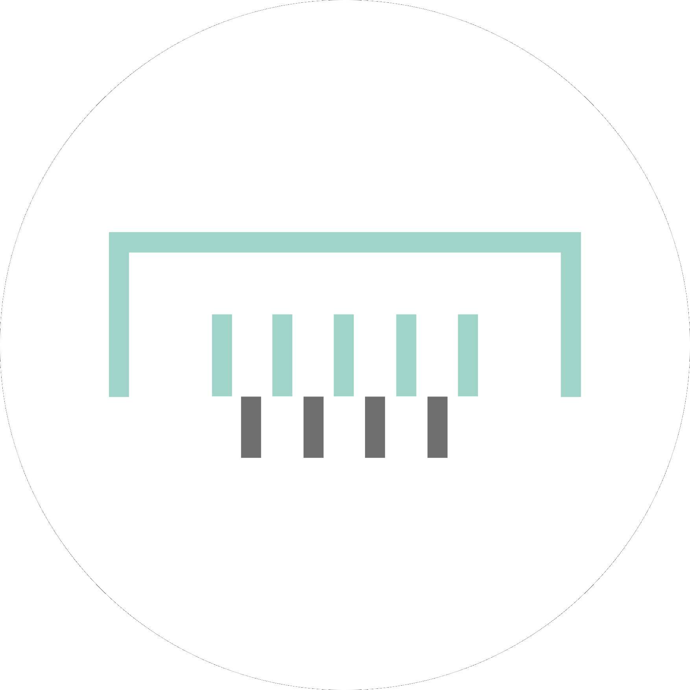

```{r setup, include=FALSE, warning=FALSE}
knitr::opts_chunk$set(echo = TRUE)

library(kableExtra)
library(icons)

add_Link <- function(link, icon, font) {
  paste0("<a href=\"", link, "\" target=\"_blank\">", as.character(if (font == "ai") {academicons(icon)} else {fontawesome(icon)}), "</a>")
}

source("../update.R")

```

## What is GlobaLID? 
GlobaLID is a Global Lead Isotope Database and aims to facilitate the reconstruction of raw material provenances with lead isotopes, especially in archaeology. The app provides direct access to and convenient interaction with the [GlobaLID database](https://doi.org/10.5880/fidgeo.2023.043){target="_blank"}. You can filter the database according to your research question, upload own data to compare it with GlobaLID, and produce and download publication ready plots. Please watch our [video tutorial](https://www.youtube.com/watch?v=qwKStMc-068){target="_blank"} for a "life" demonstration. The "References" page lists all references from which data are currently included in GlobaLID. There are still data missing? Consider to become a contributor and help to let GlobaLID grow! Visit [our webpage](https://archmetaldbm.github.io/Globalid/) to learn more about the GlobaLID project and to get the latest news. 

## Copyright

© The GlobaLID Core Team `r format.Date(Sys.Date(), "%Y")` (unless indicated otherwise)

The copyright material published on this website is subject to the German Copyright law, and is owned by the GlobaLID Core Team or, where indicated, by a party other than the GlobaLID Core Team. The GlobaLID Core Team supports and encourages use of its material for all legitimate purposes.

[](http://creativecommons.org/licenses/by/4.0/){target="_blank"} Copyright material available on this website is licensed under a [Creative Commons Attribution 4.0 International (CC-BY 4.0)](https://creativecommons.org/licenses/by/4.0/){target="_blank"} licence unless indicated otherwise. 

<details>
  <summary> Show details </summary>

This licence allows you to:

* **Share** — copy and redistribute the material in any medium or format
* **Adapt** — remix, transform, and build upon the material
* for any purpose, even commercially

provided you attribute the GlobaLID Core Team as the source of the copyright material. The GlobaLID Core Team requests attribution as:  
"GlobaLID Core Team (2021): GlobaLID web application V. `r app_version`, database status: `r format.Date(update_database, "%d %B %Y")`. <a href="https://globalid.dmt-lb.de/" target="_blank">https://globalid.dmt-lb.de/</a>. 

</details>

## How to cite 

Please attribute to GlobaLID by citing: 

* Westner, Katrin J.; Rose, Thomas; Klein, Sabine; Hsu, Yiu-Kang; Becerra, María Florencia; Nezafati, Nima; Renson, Virginie & Stephens, Jay (2023): GlobaLID – Global Lead Isotope Database. V. 1.1. GFZ Data Services. <a href="https://doi.org/10.5880/fidgeo.2023.043" target="_blank">https://doi.org/10.5880/fidgeo.2023.043</a>
* GlobaLID Core Team (2021): GlobaLID web application V. `r app_version`, database status: `r format.Date(update_database, "%F")`. <a href="https://globalid.dmt-lb.de/" target="_blank">https://globalid.dmt-lb.de/</a>
* Klein, S., Rose, T., Westner, K. J., & Hsu, Y.-K. (2022). From OXALID to GlobaLID: Introducing a modern and FAIR lead isotope database with an interactive application. Archaeometry 64(4), 935--950. <a href="https://doi.org/10.1111/arcm.12762" target="_blank">https://doi.org/10.1111/arcm.12762</a>

For direct import into your reference manager copy the citations as 
<details>
  <summary>bibtex</summary>
```
@misc{Westner.2023,
 author = {Westner, Katrin J. and Rose, Thomas and Klein, Sabine and Hsu, Yiu-Kang and Becerra, María Florencia and Nezafati, Nima and Renson, Virginie and Stephens, Jay},
 year = {2023},
 title = {{GlobaLID -- Global Lead Isotope Database V. 1.1}},
 publisher = {{GFZ Data Services}},
 doi = {10.5880/fidgeo.2023.043}, 
 url = {https://doi.org/10.5880/fidgeo.2023.043}
}

@misc{GlobaLIDCoreTeam.2022,
 author = {{GlobaLID Core Team}},
 year = {2022},
 title = {{GlobaLID web application V. `r app_version`, database status: `r format.Date(update_database, "%F")`}},
 url = {https://globalid.dmt-lb.de/}
}

@article{Klein.2022,
author = {Klein, Sabine and Rose, Thomas and Westner, Katrin J. and Hsu, Yiu-Kang},
title = {From OXALID to GlobaLID: Introducing a modern and FAIR lead isotope database with an interactive application},
journal = {Archaeometry},
volume = {64},
number = {4},
pages = {935-950},
doi = {https://doi.org/10.1111/arcm.12762},
}

```
</details>
<details>
  <summary>ris</summary>
```
TY  - DATA
AU  - Westner, Katrin J
AU  - Rose, Thomas
AU  - Klein, Sabine
AU  - Hsu, Yiu-Kang
AU  - Becerra, María Florencia
AU  - Nezafati, Nima
AU  - Renson, Virginie
AU  - Stephens, Jay
TI  - GlobaLID -- Global Lead Isotope Database
ET  - V. 1.1
PY  - 2023
DA  - 2023
PB  - GFZ Data Services
DO  - 10.5880/fidgeo.2023.043
UR  - https://doi.org/10.5880/fidgeo.2023.043
ER  - 

TY  - COMP
AU  - GlobaLID Core Team
TI  - GlobaLID web application
ET  - V. `r app_version`, database status: `r format.Date(update_database, "%F")`
PY  - 2022
DA  - 2022
UR  - https://globalid.dmt-lb.de/
ER  - 

TY  - JOUR
T1  - From OXALID to GlobaLID: Introducing a modern and FAIR lead isotope database with an interactive application
AU  - Klein, Sabine
AU  - Rose, Thomas
AU  - Westner, Katrin J.
AU  - Hsu, Yiu-Kang
PY  - 2022
DA  - 2022/02/09
DO  - https://doi.org/10.1111/arcm.12762
JF  - Archaeometry
JO  - Archaeometry
JA  - Archaeometry
VL  - 64
IS  - 4
SP  - 935
EP  - 950
SN  - 0003-813X
UR  - https://doi.org/10.1111/arcm.12762
ER  - 

```
</details>

## Team 

You want to contribute to GlobaLID? Please get in touch with us, we are looking forward to your message! 

### Core Team

```{r echo=FALSE, results='asis'}

data.frame(
  Portrait = paste0('{height=96px}'), 
  Text = paste("<b>Sabine Klein</b>", 
               "Forschungsbereich Archäometallurgie, Leibniz-Forschungsmuseum für Georessourcen/Deutsches Bergbau-Museum Bochum, Bochum, Germany <br> Institut für Archäologische Wissenschaften, Ruhr-Universität Bochum, Bochum, Germany <br> FIERCE, Frankfurt Isotope & Element Research Centre, Goethe Universität, Frankfurt am Main, Germany", 
               paste(
                 add_Link("mailto:Sabine.Klein@bergbaumuseum.de?subject=GlobaLID", "envelope", "fa"),
                 add_Link("https://www.bergbaumuseum.de/en/museum/mitarbeitende/kontakt-detailseite/prof-dr-sabine-klein", "globe", "fa"), 
                 add_Link("https://orcid.org/0000-0002-3939-4428", "orcid", "ai"),
                 add_Link("https://www.researchgate.net/profile/Sabine-Klein-3", "researchgate", "ai"),
                 sep = " "),
               sep = "<br>")
) %>%
kable(escape = FALSE, col.names = NULL, format = "html") %>% 
  column_spec(1, width_min = "110px") %>%
  column_spec(2, color = "black")
cat("<br>")

data.frame(
  Portrait = paste0('{height=96px}'), 
  Text = paste("<b>Helge Wiethoff</b>", 
               "Rechenzentrum, Technische Hochschule Georg Agricola, Bochum, Germany", 
               paste(
                 add_Link("mailto:helge.wiethoff@thga.de?subject=GlobaLID", "envelope", "fa"),
                 add_Link("https://github.com/derhelge/", "github", "fa"),
                 sep = " "), 
               sep = "<br>")
) %>%
kable(escape = FALSE, col.names = NULL, format = "html") %>% 
  column_spec(1, width_min = "110px") %>%
  column_spec(2, color = "black")
cat("<br>")

data.frame(
  Portrait = paste0('{height=96px}'), 
  Text = paste("<b>Thomas Rose</b>", 
               "Forschungsbereich Archäometallurgie, Leibniz-Forschungsmuseum für Georessourcen/Deutsches Bergbau-Museum Bochum, Bochum, Germany", 
               paste(
                 add_Link("mailto:Thomas.Rose@bergbaumuseum.de?subject=GlobaLID", "envelope", "fa"),
                 add_Link("https://copper-smelting.com/", "globe", "fa"), 
                 add_Link("https://orcid.org/0000-0002-8186-3566", "orcid", "ai"),
                 add_Link("https://bergbaumuseum.academia.edu/ThomasRose", "academia", "ai"),
                 add_Link("https://www.researchgate.net/profile/Thomas-Rose-2", "researchgate", "ai"),
                 add_Link("https://www.linkedin.com/in/thomas-rose-4200ba175", "linkedin", "fa"),
                 add_Link("https://github.com/archaeothommy/", "github", "fa"),
                 add_Link("https://gitlab.com/archaeothommy", "gitlab", "fa"),
                 add_Link("https://scholar.google.de/citations?user=mmsAHBgAAAAJ", "google-scholar", "ai"),
                 sep = " "), 
               sep = "<br>")
) %>%
kable(escape = FALSE, col.names = NULL, format = "html") %>% 
  column_spec(1, width_min = "110px") %>%
  column_spec(2, color = "black")
cat("<br>")

data.frame(
  Portrait = paste0('{height=96px}'), 
  Text = paste("<b>Tim Greifelt</b>", 
               "Forschungsbereich Archäometallurgie, Leibniz-Forschungsmuseum für Georessourcen/Deutsches Bergbau-Museum Bochum, Bochum, Germany", 
               paste(
                 add_Link("mailto:Tim.Greifelt@bergbaumuseum.de?subject=GlobaLID", "envelope", "fa"),
                 add_Link("https://www.bergbaumuseum.de/museum/mitarbeitende/kontakt-detailseite/tim-greifelt", "globe", "fa"), 
                 add_Link("https://orcid.org/0009-0007-9701-8547", "orcid", "ai"),
                 sep = " "), 
               sep = "<br>")
) %>%
kable(escape = FALSE, col.names = NULL, format = "html") %>% 
  column_spec(1, width_min = "110px") %>%
  column_spec(2, color = "black")
cat("<br>")

data.frame(
  Portrait = paste0('{height=96px}'), 
  Text = paste("<b>Katrin J. Westner</b>", 
               "Forschungsbereich Archäometallurgie, Leibniz-Forschungsmuseum für Georessourcen/Deutsches Bergbau-Museum Bochum, Bochum, Germany", 
               paste(
                 add_Link("mailto:katrin.westner@bergbaumuseum.de?subject=GlobaLID", "envelope", "fa"),
                 add_Link("https://www.bergbaumuseum.de/museum/mitarbeitende/kontakt-detailseite/dr-katrin-julia-westner", "globe", "fa"),
                 add_Link("https://orcid.org/0000-0001-5529-1165", "orcid", "ai"),
                 add_Link("https://bergbaumuseum.academia.edu/KatrinWestner", "academia", "ai"),
                 add_Link("https://www.researchgate.net/profile/Katrin-Westner", "researchgate", "ai"),
                 sep = " "), 
               sep = "<br>")
) %>% 
  kable(escape = FALSE, col.names = NULL, format = "html") %>% 
  column_spec(1, width_min = "110px") %>%
  column_spec(2, color = "black")
cat("<br>")

data.frame(
  Portrait = paste0('{height=96px}'), 
  Text = paste("<b>Yiu-Kang Hsu</b>", 
               "Forschungsbereich Archäometallurgie, Leibniz-Forschungsmuseum für Georessourcen/Deutsches Bergbau-Museum Bochum, Bochum, Germany", 
               paste(
                 add_Link("mailto:Yiu-Kang.Hsu@bergbaumuseum.de?subject=GlobaLID", "envelope", "fa"),
                 add_Link("https://www.bergbaumuseum.de/en/museum/mitarbeitende/kontakt-detailseite/yiu-kang-hsu", "globe", "fa"), 
                 add_Link("https://orcid.org/0000-0002-2439-4863", "orcid", "ai"),
                 sep = " "), 
               sep = "<br>")
) %>%
kable(escape = FALSE, col.names = NULL, format = "html") %>% 
  column_spec(1, width_min = "110px") %>%
  column_spec(2, color = "black")
cat("<br>")

data.frame(
  Portrait = paste0('{height=96px}'), 
  Text = paste("<b>Annette Hornschuch</b>", 
               "Forschungsbereich Montanarchäologie, Leibniz-Forschungsmuseum für Georessourcen/Deutsches Bergbau-Museum Bochum, Bochum, Germany", 
               paste(
                 add_Link("mailto:Annette.Hornschuch@bergbaumuseum.de?subject=GlobaLID", "envelope", "fa"),
                 add_Link("https://www.bergbaumuseum.de/museum/mitarbeitende/kontakt-detailseite/annette-hornschuch", "globe", "fa"), 
                 sep = " "), 
               sep = "<br>")
) %>%
kable(escape = FALSE, col.names = NULL, format = "html") %>% 
  column_spec(1, width_min = "110px") %>%
  column_spec(2, color = "black")
cat("<br>")

```

### Regional editors

```{r echo=FALSE, results='asis'}

data.frame(
  Portrait = paste0('{height=96px}'), 
  Text = paste("<b>María Florencia Becerra</b> (South America)", 
               "CONICET (Consejo Nacional de Investigaciones Científicas  y Técnicas) - División Arqueología, Museo de La Plata, Facultad de Ciencias Naturales y Museo, Universidad Nacional de La Plata, Argentina", 
               paste(
                 add_Link("https://www.conicet.gov.ar/new_scp/mail.php?id=29835&detalle=yes&esprimera=1", "envelope", "fa"),
                 add_Link("https://www.conicet.gov.ar/new_scp/detalle.php?id=29835", "globe", "fa"),
                 add_Link("https://orcid.org/0000-0001-6302-7452", "orcid", "ai"),
                 sep = " "), 
               sep = "<br>")
) %>% 
  kable(escape = FALSE, col.names = NULL, format = "html") %>% 
  column_spec(1, width_min = "110px") %>%
  column_spec(2, color = "black")
cat("<br>")

data.frame(
  Portrait = paste0('{height=96px}'), 
  Text = paste("<b>Meghna Desai</b> (India)", 
               "Science and Technology in Archaeology and Culture Research Center (STARC), The Cyprus Institute, Nicosia, Cyprus", 
               paste(
                 add_Link("mailto:m.desai@cyi.ac.cy", "envelope", "fa"),
                 add_Link("https://www.cyi.ac.cy/index.php/starc/about-the-center/starc-our-people/author/1059-meghna-desai.html", "globe", "fa"),
                 sep = " "), 
               sep = "<br>")
) %>% 
  kable(escape = FALSE, col.names = NULL, format = "html") %>% 
  column_spec(1, width_min = "110px") %>%
  column_spec(2, color = "black")
cat("<br>")

data.frame(
  Portrait = paste0('{height=96px}'), 
  Text = paste("<b>Thomas R. Fenn</b> (South Asia, North Africa)", 
               "Department of Anthropology, University of Oklahoma, Norman, OK, USA", 
               paste(
                 add_Link("mailto:Thomas.Fenn@ou.edu?subject=GlobaLID", "envelope", "fa"),
                 add_Link("https://www.ou.edu/cas/anthropology/faculty-staff/thomas-fenn", "globe", "fa"),
                 add_Link("https://orcid.org/0000-0001-8560-6797", "orcid", "ai"),
                 add_Link("https://ou.academia.edu/ThomasFenn", "academia", "ai"),
                 add_Link("https://www.researchgate.net/profile/Thomas-Fenn", "researchgate", "ai"),
                 add_Link("https://scholar.google.com/citations?user=biK7yyYAAAAJ", "google-scholar", "ai"),
                 sep = " "), 
               sep = "<br>")
) %>% 
  kable(escape = FALSE, col.names = NULL, format = "html") %>% 
  column_spec(1, width_min = "110px") %>%
  column_spec(2, color = "black")
cat("<br>")

data.frame(
  Portrait = paste0('{height=96px}'), 
  Text = paste("<b>Siran Liu</b> (China)", 
               "Institute for Cultural Heritage and History of Science & Technology, University of Science and Technology Beijing, China", 
               paste(
                 add_Link("mailto:siran.liu@ustb.edu.cn?subject=GlobaLID", "envelope", "fa"),
                 add_Link("https://enihmm.ustb.edu.cn/Staff/Academic_Senior_Research_Staff/bde24d0cde654407b9c56f78a81490a9.htm", "globe", "fa"),
                 add_Link("https://orcid.org/0000-0001-9250-4561", "orcid", "ai"),
                 add_Link("https://www.researchgate.net/profile/Siran-Liu-4", "researchgate", "ai"),
                 sep = " "), 
               sep = "<br>")
) %>% 
  kable(escape = FALSE, col.names = NULL, format = "html") %>% 
  column_spec(1, width_min = "110px") %>%
  column_spec(2, color = "black")
cat("<br>")

data.frame(
  Portrait = paste0('{height=96px}'), 
  Text = paste("<b>Nima Nezafati</b> (Iran)", 
               "Forschungsbereich Archäometallurgie, Leibniz-Forschungsmuseum für Georessourcen/Deutsches Bergbau-Museum Bochum, Bochum, Germany",  
               paste(
                 add_Link("mailto:nima.nezafati@bergbaumuseum.de?subject=GlobaLID", "envelope", "fa"),
                 add_Link("https://www.bergbaumuseum.de/en/museum/mitarbeitende/kontakt-detailseite/dr-nima-nezafati", "globe", "fa"),
                 add_Link("https://orcid.org/0000-0002-5806-343X", "orcid", "ai"),
                 add_Link("https://bergbaumuseum.academia.edu/NimaNezafati", "academia", "ai"),
                 add_Link("http://www.researchgate.net/profile/Nima_Nezafati", "researchgate", "ai"),
                 add_Link("https://ir.linkedin.com/in/nima-nezafati-5a4b5542", "linkedin", "fa"),
                 sep = " "), 
               sep = "<br>")
) %>%
kable(escape = FALSE, col.names = NULL, format = "html") %>% 
  column_spec(1, width_min = "110px") %>%
  column_spec(2, color = "black")
cat("<br>")


data.frame(
  Portrait = paste0('{height=96px}'), 
  Text = paste("<b>T. O. Pryce</b> (Southeast Asia)", 
               "Centre National de la Recherche Scientifique, UMR 7065 Institut de Recherche sur les ArchéoMATériaux, Université Paris-Saclay & CEA/CNRS UMR 3685 NIMBE, 91191 Gif-sur-Yvette, France", 
               paste(
                 add_Link("mailto:oliver.pryce@cnrs.fr?subject=GlobaLID", "envelope", "fa"),
                 add_Link("https://iramat.cnrs.fr/user/oliver.pryce/", "globe", "fa"), 
                 add_Link("https://orcid.org/0000-0002-7290-141X", "orcid", "ai"),
                 add_Link("https://www.researchgate.net/profile/Oliver-Pryce-2", "researchgate", "ai"),
                 sep = " "),
               sep = "<br>")
) %>%
kable(escape = FALSE, col.names = NULL, format = "html") %>% 
  column_spec(1, width_min = "110px") %>%
  column_spec(2, color = "black")
cat("<br>")

data.frame(
  Portrait = paste0('{height=96px}'), 
  Text = paste("<b>Virginie Renson</b> (North America)", 
               "Archaeometry Laboratory, Research Reactor Center, University of Missouri, Columbia, MO, USA", 
               paste(
                 add_Link("mailto:RensonV@missouri.edu?subject=GlobaLID", "envelope", "fa"),
                 add_Link("https://archaeometry.missouri.edu/profile(Virginie).html", "globe", "fa"),
                 add_Link("https://orcid.org/0000-0002-5701-0985", "orcid", "ai"),
                 sep = " "), 
               sep = "<br>")
) %>% 
  kable(escape = FALSE, col.names = NULL, format = "html") %>% 
  column_spec(1, width_min = "110px") %>%
  column_spec(2, color = "black")
cat("<br>")

data.frame(
  Portrait = paste0('{height=96px}'), 
  Text = paste("<b>Jay Stephens</b> (Africa)", 
               "School of Anthropology, University of Arizona, Tucson, AZ, USA <br> Archaeometry Laboratory, Research Reactor Center, University of Missouri, Columbia, MO, USA", 
               paste(
                 add_Link("mailto:jasvxq@missouri.edu?subject=GlobaLID", "envelope", "fa"),
                 add_Link("https://archaeometry.missouri.edu/staff.html", "globe", "fa"), 
                 add_Link("https://orcid.org/0000-0003-1299-3946", "orcid", "ai"),
                 add_Link("https://www.researchgate.net/profile/Jay-Stephens-2", "researchgate", "ai"),
                 add_Link("https://scholar.google.com/citations?user=vT2uGPUAAAAJ", "google-scholar", "ai"),
                 sep = " "), 
               sep = "<br>")
) %>%
kable(escape = FALSE, col.names = NULL, format = "html") %>% 
  column_spec(1, width_min = "110px") %>%
  column_spec(2, color = "black")
cat("<br>")

```

### Material editors

```{r echo=FALSE, results='asis'}

data.frame(
  Portrait = paste0('{height=96px}'), 
  Text = paste("<b>Andrea Acevedo Mejía</b> (Pigments)", 
               "Austrian Archaeological Institute, Austrian Academy of Sciences, Vienna, Austria", 
               paste(
                 add_Link("mailto:Andrea.AcevedoMejia@oeaw.ac.at?subject=GlobaLID", "envelope", "fa"),
                 add_Link("https://www.oeaw.ac.at/en/oeai/institute/team/person/andrea-acevedo-mejia", "globe", "fa"),
                 add_Link("https://orcid.org/0009-0002-7441-1737", "orcid", "ai"),
                 add_Link("https://www.researchgate.net/profile/Andrea_Acevedo_Mejia", "researchgate", "ai"),
                 add_Link("https://www.linkedin.com/in/andrea-acevedo-ru/", "linkedin", "fa"),
                 sep = " "), 
               sep = "<br>")
) %>% 
  kable(escape = FALSE, col.names = NULL, format = "html") %>% 
  column_spec(1, width_min = "110px") %>%
  column_spec(2, color = "black")
cat("<br>")

data.frame(
  Portrait = paste0('{height=96px}'), 
  Text = paste("<b>Laure Dussubieux</b> (Glass)", 
               "Field Museum, Chicago, IL, USA", 
               paste(
                 add_Link("mailto:ldussubieux@fieldmuseum.org?subject=GlobaLID", "envelope", "fa"),
                 add_Link("https://www.fieldmuseum.org/about/staff/profile/laure-dussubieux", "globe", "fa"),
                 add_Link("https://orcid.org/0000-0002-9334-8131", "orcid", "ai"),
                 add_Link("https://scholar.google.com/citations?user=i8wpGuEAAAAJ", "google-scholar", "ai"),
                 sep = " "), 
               sep = "<br>")
) %>% 
  kable(escape = FALSE, col.names = NULL, format = "html") %>% 
  column_spec(1, width_min = "110px") %>%
  column_spec(2, color = "black")
cat("<br>")

data.frame(
  Portrait = paste0('{height=96px}'), 
  Text = paste("<b>Thomas R. Fenn</b> (Glass)", 
               "Department of Anthropology, University of Oklahoma, Norman, OK, USA", 
               paste(
                 add_Link("mailto:Thomas.Fenn@ou.edu?subject=GlobaLID", "envelope", "fa"),
                 add_Link("https://www.ou.edu/cas/anthropology/faculty-staff/thomas-fenn", "globe", "fa"),
                 add_Link("https://orcid.org/0000-0001-8560-6797", "orcid", "ai"),
                 add_Link("https://ou.academia.edu/ThomasFenn", "academia", "ai"),
                 add_Link("https://www.researchgate.net/profile/Thomas-Fenn", "researchgate", "ai"),
                 add_Link("https://scholar.google.com/citations?user=biK7yyYAAAAJ", "google-scholar", "ai"),
                 sep = " "), 
               sep = "<br>")
) %>% 
  kable(escape = FALSE, col.names = NULL, format = "html") %>% 
  column_spec(1, width_min = "110px") %>%
  column_spec(2, color = "black")
cat("<br>")

data.frame(
  Portrait = paste0('{height=96px}'), 
  Text = paste("<b>Alicia Van Ham-Meert</b> (Glass)", 
               "FNRS researcher CReA-patrimoine and 4MAT, Université Libre de Bruxelles, Belgium", 
               paste(
                 add_Link("mailto:alicia.van.hammeert@ulb.be?subject=GlobaLID", "envelope", "fa"),
                 add_Link("https://crea.phisoc.ulb.be/fr/corps-scientifique/van-ham-meert-alicia-1", "globe", "fa"),
                 add_Link("https://orcid.org/0000-0001-6796-3141", "orcid", "ai"),
                 add_Link("https://www.researchgate.net/profile/Alicia-Van-Ham-Meert", "researchgate", "ai"),
                 add_Link("https://scholar.google.com/citations?user=jglaXPIAAAAJ", "google-scholar", "ai"),
                 sep = " "), 
               sep = "<br>")
) %>% 
  kable(escape = FALSE, col.names = NULL, format = "html") %>% 
  column_spec(1, width_min = "110px") %>%
  column_spec(2, color = "black")
cat("<br>")

data.frame(
  Portrait = paste0('{height=96px}'), 
  Text = paste("<b>Maxime L'Héritier</b> (Lead items)", 
               "University of Paris 8, Paris, France", 
               paste(
                 add_Link("mailto:maxime.l_heritier@univ-paris8.fr", "envelope", "fa"),
                 add_Link("https://arscan.parisnanterre.fr/membre/maxime-lheritier/", "globe", "fa"),
                 add_Link("https://orcid.org/0000-0003-3428-2977", "orcid", "ai"),
                 sep = " "), 
               sep = "<br>")
) %>% 
  kable(escape = FALSE, col.names = NULL, format = "html") %>% 
  column_spec(1, width_min = "110px") %>%
  column_spec(2, color = "black")
cat("<br>")

data.frame(
  Portrait = paste0('{height=96px}'), 
  Text = paste("<b>T. O. Pryce</b> (Copper items)", 
               "Centre National de la Recherche Scientifique, UMR 7065 Institut de Recherche sur les ArchéoMATériaux, Université Paris-Saclay & CEA/CNRS UMR 3685 NIMBE, 91191 Gif-sur-Yvette, France", 
               paste(
                 add_Link("mailto:oliver.pryce@cnrs.fr?subject=GlobaLID", "envelope", "fa"),
                 add_Link("https://iramat.cnrs.fr/user/oliver.pryce/", "globe", "fa"), 
                 add_Link("https://orcid.org/0000-0002-7290-141X", "orcid", "ai"),
                 add_Link("https://www.researchgate.net/profile/Oliver-Pryce-2", "researchgate", "ai"),
                 sep = " "),
               sep = "<br>")
) %>%
kable(escape = FALSE, col.names = NULL, format = "html") %>% 
  column_spec(1, width_min = "110px") %>%
  column_spec(2, color = "black")
cat("<br>")

data.frame(
  Portrait = paste0('{height=96px}'), 
  Text = paste("<b>Frederik Rademakers</b> (Copper items)", 
               "Department of Scientific Research, British Museum, London, United Kingdom", 
               paste(
                 add_Link("mailto:FRademakers@britishmuseum.org?subject=GlobaLID", "envelope", "fa"),
                 add_Link("https://www.oeaw.ac.at/en/oeai/institute/team/person/alexandra-rodler", "globe", "fa"),
                 add_Link("https://orcid.org/0000-0002-6036-1612", "orcid", "ai"),
                 add_Link("https://www.researchgate.net/profile/Frederik-Rademakers", "researchgate", "ai"),
                 add_Link("https://britishmuseum.academia.edu/FrederikRademakers", "academia", "ai"),
                 add_Link("https://scholar.google.dk/citations?user=Hvugz7oAAAAJ", "google-scholar", "ai"),
                 sep = " "), 
               sep = "<br>")
) %>% 
  kable(escape = FALSE, col.names = NULL, format = "html") %>% 
  column_spec(1, width_min = "110px") %>%
  column_spec(2, color = "black")
cat("<br>")

data.frame(
  Portrait = paste0('{height=96px}'), 
  Text = paste("<b>Alexandra Rodler-Rørbo</b> (Pigments)", 
               "Austrian Archaeological Institute, Austrian Academy of Sciences, Vienna, Austria", 
               paste(
                 add_Link("mailto:Alexandra.Rodler-Roerbo@oeaw.ac.at?subject=GlobaLID", "envelope", "fa"),
                 add_Link("https://www.oeaw.ac.at/en/oeai/institute/team/person/alexandra-rodler", "globe", "fa"),
                 add_Link("https://orcid.org/0000-0002-4087-7160", "orcid", "ai"),
                 add_Link("https://www.researchgate.net/profile/Alexandra-Rodler-Rorbo", "researchgate", "ai"),
                 add_Link("https://scholar.google.dk/citations?user=XHRm-HQAAAAJ", "google-scholar", "ai"),
                 add_Link("https://www.oeaw.ac.at/en/oeai/research/archaeological-sciences/geochemistry-lab", "globe", "fa"),
                 sep = " "), 
               sep = "<br>")
) %>% 
  kable(escape = FALSE, col.names = NULL, format = "html") %>% 
  column_spec(1, width_min = "110px") %>%
  column_spec(2, color = "black")
cat("<br>")

data.frame(
  Portrait = paste0('{height=96px}'), 
  Text = paste("<b>David Wigg-Wolf</b> (Coins)", 
               "Römisch-Germanische Kommission des Deutschen Archäologischen Instituts, Frankfurt, Germany", 
               paste(
                 add_Link("mailto:david.wigg-wolf@dainst.de?subject=GlobaLID", "envelope", "fa"),
                 add_Link("https://www.dainst.org/wer-wir-sind/mitarbeitende/noslug/574", "globe", "fa"),
                 add_Link("https://orcid.org/0000-0002-8604-544X", "orcid", "ai"),
                 add_Link("https://www.researchgate.net/profile/David-Wigg-Wolf ", "researchgate", "ai"),
                 add_Link("https://scholar.google.com/citations?hl=en&user=DAcfipMAAAAJ", "google-scholar", "ai"),
                 sep = " "), 
               sep = "<br>")
) %>% 
  kable(escape = FALSE, col.names = NULL, format = "html") %>% 
  column_spec(1, width_min = "110px") %>%
  column_spec(2, color = "black")
cat("<br>")

data.frame(
  Portrait = paste0('{height=96px}'), 
  Text = paste("<b>Grzegorz Żabiński</b> (Archaeological materials)", 
               "Institute of History, Jan Długosz University in Częstochowa, Częstochowa, Poland", 
               paste(
                 add_Link("mailto:g.zabinski@ujd.edu.pl?subject=GlobaLID", "envelope", "fa"),
                 add_Link("https://usosweb.ujd.edu.pl/kontroler.php?_action=katalog2/osoby/pokazOsobe&os_id=12306", "globe", "fa"),
                 add_Link("https://orcid.org/0000-0003-3091-1035", "orcid", "ai"),
                 add_Link("https://independent.academia.edu/GrzegorzZabinski", "academia", "ai"),
                 add_Link("https://www.researchgate.net/profile/Grzegorz-Zabinski", "researchgate", "ai"),
                 add_Link("https://scholar.google.com/citations?user=fdK4tLoAAAAJ", "google-scholar", "ai"),
                 sep = " "), 
               sep = "<br>")
) %>% 
  kable(escape = FALSE, col.names = NULL, format = "html") %>% 
  column_spec(1, width_min = "110px") %>%
  column_spec(2, color = "black")
cat("<br>")

```

### Contributors (Data)

```{r echo=FALSE, results='asis'}

data.frame(
  Portrait = paste0('{height=96px}'), 
  Text = paste("<b>Rebekka Elsasser</b>", 
               "Forschungsbereich Archäometallurgie, Leibniz-Forschungsmuseum für Georessourcen/Deutsches Bergbau-Museum Bochum, Bochum, Germany", 
               sep = "<br>")
) %>%
kable(escape = FALSE, col.names = NULL, format = "html") %>% 
  column_spec(1, width_min = "110px") %>%
  column_spec(2, color = "black")
cat("<br>")

data.frame(
  Portrait = paste0('{height=96px}'), 
  Text = paste("<b>Sabine Fischer-Lechner</b>", 
               "Forschungsbereich Archäometallurgie, Leibniz-Forschungsmuseum für Georessourcen/Deutsches Bergbau-Museum Bochum, Bochum, Germany", 
               sep = "<br>")
) %>%
kable(escape = FALSE, col.names = NULL, format = "html") %>% 
  column_spec(1, width_min = "110px") %>%
  column_spec(2, color = "black")
cat("<br>")

data.frame(
  Portrait = paste0('{height=96px}'), 
  Text = paste("<b>Daniel M. Finn</b>", 
               "The Hebrew University of Jerusalem, Israel", 
               paste(
                 add_Link("mailto:Danny.m.finn@gmail.com?subject=GlobaLID", "envelope", "fa"),
                 add_Link("https://orcid.org/0009-0000-0953-0006", "orcid", "ai"),
                 add_Link("https://independent.academia.edu/DanielFinn16", "academia", "ai"),
                 add_Link("https://www.linkedin.com/in/daniel-m-finn/", "linkedin", "fa"),
                 sep = " "),
               sep = "<br>")
) %>%
kable(escape = FALSE, col.names = NULL, format = "html") %>% 
  column_spec(1, width_min = "110px") %>%
  column_spec(2, color = "black")
cat("<br>")

```

## Partners and Supporting Institutions
```{r echo=FALSE, results='asis'}

data.frame(
  Logo = paste0('{width=96px}'), 
  Text = paste("Web Hosting: ", 
               '<b><a href="https://www.bergbaumuseum.de/en/" target="_blank">Deutsches Bergbau-Museum Bochum</a></b>', 
               "The Deutsches Bergbau-Museum Bochum – founded in 1930 – is one of eight research museums belonging to the Leibniz Association. It researches, teaches and preserves the history of the mining, processing and use of geo-resources across all of the relevant time periods. Its research areas include: archaeometallurgy, mining history, materials science, and mining archaeology, together with the research laboratory, and the Montanhistorische Dokumentationszentrum.", 
               sep = "<br>")
) %>%
kable(escape = FALSE, col.names = NULL, format = "html") %>% 
  column_spec(1, width_min = "110px") %>%
  column_spec(2, color = "black")
cat("<br>")

data.frame(
  Logo = paste0('{width=96px}'), 
  Text = paste("Web Hosting: ", 
               '<b><a href="https://www.dmt-lb.de/" target="_blank">DMT-Gesellschaft für Lehre und Bildung mbH</a></b>', 
               "DMT-Gesellschaft für Lehre und Bildung mbH (DMT-LB), based in Bochum, is a collective association of the German coal mining industry and acts as the funding organisation of Deutsches Bergbau-Museum Bochum (German Mining Museum) and Technische Hochschule Georg Agricola. It was established as the Westfälische Berggewerkschaftskasse (WBK) in 1864 and merged with the Steinkohlen-Bergbau-Verein (Stbv) and Bergbau Forschung GmbH under the auspices of DeutscheMontanTechnologie e.V. (DMT) in 1990.", 
               sep = "<br>")
) %>%
kable(escape = FALSE, col.names = NULL, format = "html") %>% 
  column_spec(1, width_min = "110px") %>%
  column_spec(2, color = "black")
cat("<br>")
```

## Funding
```{r echo=FALSE, results='asis'}

data.frame(
  Logo = paste0('{width=150px}'),
  Text = paste('<b><a href="https://www.dfg.de/en" target="_blank">Deutsche Forschungsgemeinschaft</a></b>', 
               "This work has received funding from the German Research Foundation (DFG) through the grants KL 1259/17-1 and WI 5923/2-1 (project number: 524790825).", 
               sep = "<br>")
) %>%
kable(escape = FALSE, col.names = NULL, format = "html") %>% 
  column_spec(1, width_min = "170px") %>%
  column_spec(2, color = "black")
cat("<br>")

```

## Acknowledgements

The initial GlobaLID database was compiled during years of own research and profited from the generous sharing of published lead isotope datasets by many colleagues. The creative and collective work of compiling the database and application was initiated when all members of the Core Team and E. Salzmann were members of the Archaeometallurgy group at the Deutsches Berbau-Museum Bochum (DBM). Hannah Zietsch (DBM) compiled the initial literature references. Annette Hornschuch (DBM) and Helge Wiethoff (DMT-LB) provided support during the preparation and deployment of the app. 

The Core Team feels deeply grateful for the support of the contributors. Without their efforts, GlobaLID would grow much slower and less accurate. 

We are indebted to the R Core Team for providing and maintaining [R](https://cran.r-project.org/){target="_blank"} and all the authors of the fantastic packages we use, especially Hadley Wickham and the RStudio team. We are immensely grateful to the [OpenStreetMap contributors](https://www.openstreetmap.org){target="_blank"} from whose Nominatim database we obtain most of the the geographical meta-information. Last but definitely not least, the knowledge provided by the community on [Stackoverflow](https://stackoverflow.com/){target="_blank"} and many other pages was a constant source of inspiration and an enormous help during the development of the app. 

The following packages are used in the app and/or for work on the database: 

* [bs4Dash](https://rinterface.github.io/bs4Dash/){target="_blank"}
* [dplyr](https://dplyr.tidyverse.org/){target="_blank"}
* [DT](https://rstudio.github.io/DT/){target="_blank"}
* [ggplot2](https://ggplot2.tidyverse.org/){target="_blank"}
* [kableExtra](https://haozhu233.github.io/kableExtra/){target="_blank"}
* [knitr](https://yihui.org/knitr/){target="_blank"}
* [ks](https://cran.r-project.org/web/packages/ks/){target="_blank"}
* [leaflet](https://rstudio.github.io/leaflet/){target="_blank"}
* [leaflet.providers](https://github.com/rstudio/leaflet.providers){target="_blank"}
* [lemon](https://github.com/stefanedwards/lemon){target="_blank"}
* [plotly](https://plotly-r.com/){target="_blank"}
* [RColorBrewer](https://cran.r-project.org/web/packages/RColorBrewer/){target="_blank"}
* [readr](https://readr.tidyverse.org/){target="_blank"}
* [rmarkdown](https://rmarkdown.rstudio.com/){target="_blank"}
* [rootSolve](https://cran.r-project.org/web/packages/rootSolve){target="_blank"}
* [sendmailR](https://cran.r-project.org/web/packages/sendmailR/){target="_blank"}
* [shiny](https://shiny.rstudio.com/){target="_blank"}
* [shinyvalidate](https://rstudio.github.io/shinyvalidate/){target="_blank"}
* [stringr](https://stringr.tidyverse.org/){target="_blank"}
* [tidygeocoder](https://github.com/jessecambon/tidygeocoder){target="_blank"}
* [tidyr](https://tidyr.tidyverse.org/){target="_blank"}
* [viridisLite](https://sjmgarnier.github.io/viridisLite/){target="_blank"}
* [waiter](https://shiny.john-coene.com/waiter/){target="_blank"}
* [zip](https://cran.r-project.org/web/packages/zip){target="_blank"}

The implementation of the hCaptcha is a modified version of [shinyCAPTCHA](https://github.com/carlganz/shinyCAPTCHA){target="_blank"}. 
