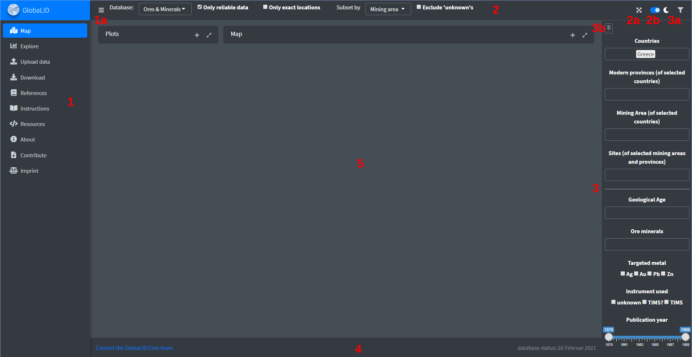
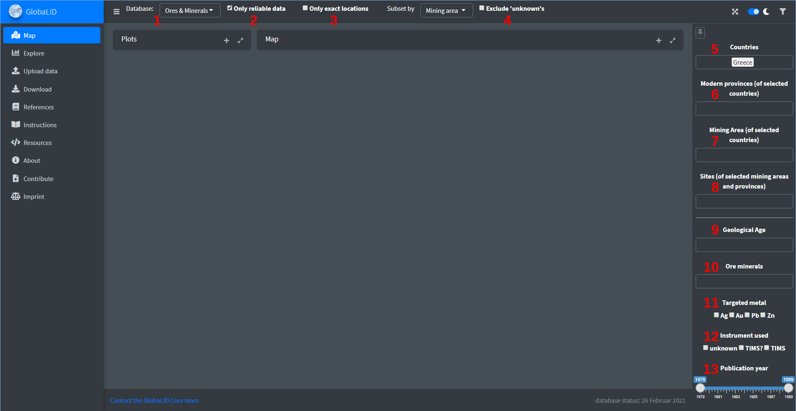
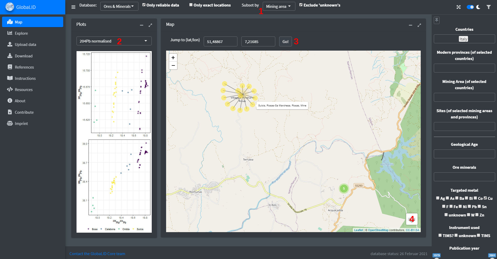
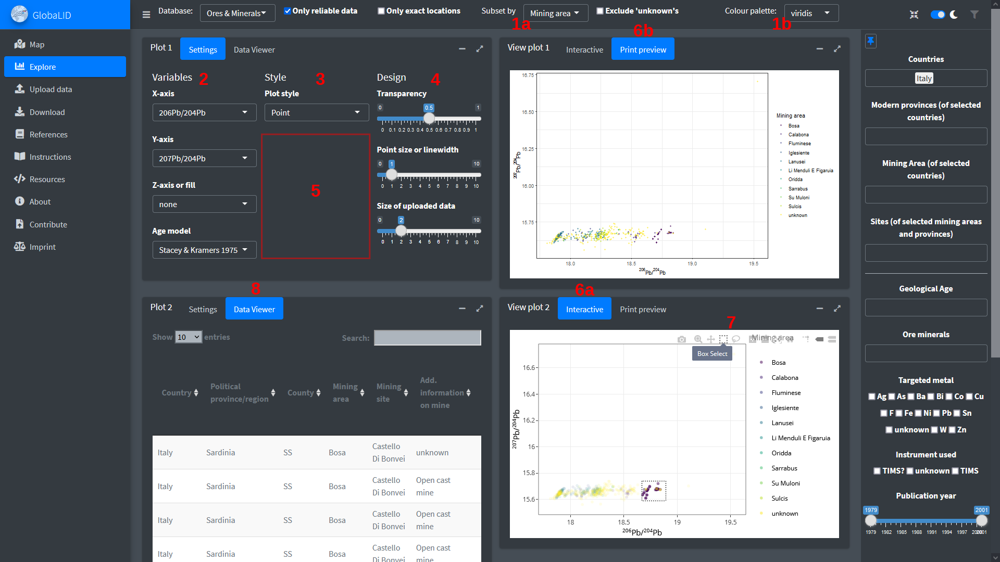
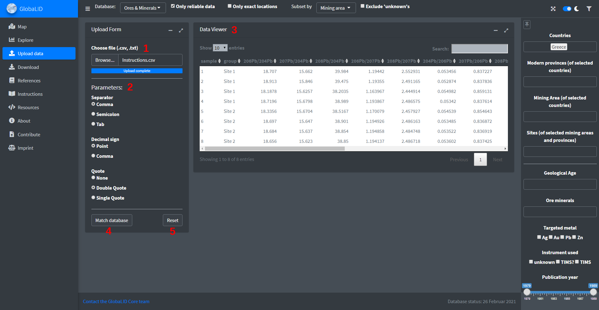
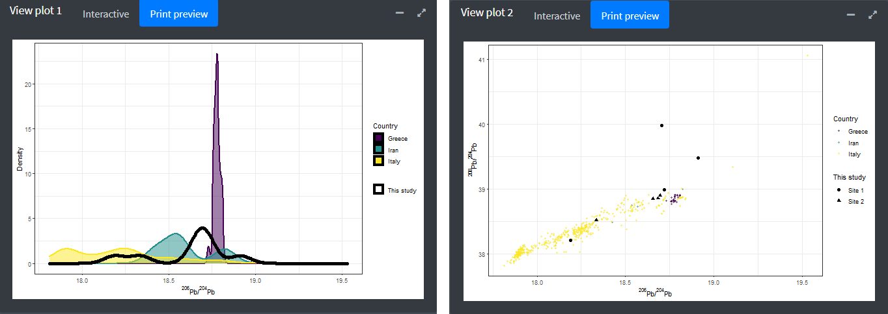
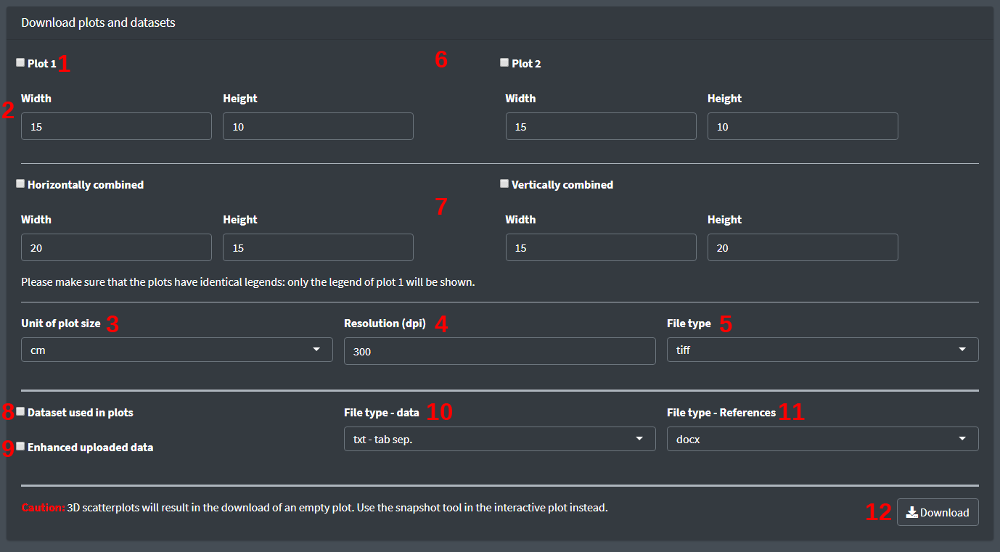

```{r setup, include=FALSE}
knitr::opts_chunk$set(echo = TRUE)

library(knitr)
```

### Interface of the app
The interface of the app consists of five parts: 

1. The menu, which can be shown/hidden with the button 1a
2. The header with two options to control the app's appearance: Toggle full screen mode (2a) and toggle light/dark mode (2b)
3. Different filter for the database, which can be shown/hidden (3a) and unpinned/pinned (3b)
4. The footer
5. The work area. All windows here can be collapsed and also maximised. If maximised, their content will be scaled accordingly. 

```{r echo=FALSE, out.width = "100%"}

```

### Filter the database

A wide range of options are provided to filter the database. The elements in the header (1 to 4) can be used to adjust some general settings and the elements in the filter area (5 to 13) allow to select data according to specific criteria. 

1. The database to be used. Currently, only "Ores & minerals" are supported but it is planned to provide additional datasets in the future
2. Whether the whole dataset or only reliable data should be used. The reliability of the data is based solely on the analytical method and excludes all analyses pre-1974 (no mass bias correction) and analyses not measured with a [TIMS](https://en.wikipedia.org/wiki/Isotope-ratio_mass_spectrometry#Thermal_ionization_mass_spectrometry) or [MC-ICP-MS](https://en.wikipedia.org/wiki/Isotope-ratio_mass_spectrometry#Multiple_collector_inductively_coupled_plasma_mass_spectrometry) (too imprecise). By default, this option is active. 
3. If only data with exact locations should be used or not. Sometimes, the location or site where the sample was taken cannot be reconstructed. In these cases, coordinates of the next smallest reliably determinable geographical or administrative entity are recorded. 
4. Whether "unknowns" should be excluded or not. Similar to the location, e.g. the mining site is not always reported. This option is only working on the current subsetting variable. Consequently, switching this variable (e.g. to the country) can change the number of displayed data points. Activating this option will also prevent the appearance of a legend item "unknown" in the plots. 
5. Select only data located in the specified modern country. 
6. Select only data located in the specified modern political provinces of the selected countries. They appear in the order of the selected countries. 
7. Select only data located in the specified mining regions in the selected countries. They appear in the order of the selected countries. 
8. Select only data from specific sites located within the modern political provinces or mining regions. 
9. Restrict the selection to samples from deposits that were formed in the selected geological epochs/ages.
10. Restrict the selection to minerals that are contained in the ore (brackets around a mineral indicate that this is only a subordinate phase of the ore). 
11. Restrict the selection to metals that can be (theoretically) produced from the ores (brackets around an element indicate that only minor amounts of this metal could be produced). This does not necessarily mean that all metals given here were also extracted from the ore, and the produced metal(s) may be subject to changes over time. 
12. Restrict the instrument(s) used to produce the data. 
13. Restrict the selection to publications of a certain range of year, e.g. all publications after 2000. 

```{r echo=FALSE, out.width = "100%"}

```

How the filter work: 

* Click on the items in the list to select multiple ones. In the dropdown lists, you can remove them from the filter by clicking on an item (it changes the colour) and pressing `DELETE`. 
* Changing a filter on a higher level (e.g. country) will reset all filter on the lower levels (e.g. mining area). This holds also true for switching between reliable data and the full data set. 
* All items within the same filter are OR connected, i.e. picking galena and chalcopyrite as minerals will yield all data that contain galena OR chalcopyrite (or both) beside other mineral phases. 
* Area above the horizontal line (5 to 8)
  + You must pick one or multiple countries. 
  + Based on the picked countries, the respective provinces and mining areas become available. Provinces and mining areas are OR connected (e.g. picking Italy and Egypt as countries and then Sardinia as province and the Eastern Desert as mining area will show all data from Sardinia and the Eastern Desert). 
  + Based on the chosen provinces and mining areas, the mining sites become available narrow the selection further if desired.
* Area below the horizontal line (9 to 13): 
  + Changing filters above the horizontal line will reset the filters below the horizontal line.
  + These filters will be applied on the selection obtained from the filters 5 to 8. If no items are picked, the entire database will be filtered to display e.g. all copper ores or all ores containing galena.  
  + All filters in this area are connected by AND conditions. For example, picking Cu as commodity and MC-ICP-MS as instrument will yield only copper ores measured by MC-ICP-MS. 
* The menu "Upload" provides an auto-match function for uploaded data. See the respective chapter for further details. 

### Map 

The selected data (and any uploaded data) are displayed in the map and in the preview plots in the same colours. The plots are static and intended for preview only. You can modify these elements with the following options: 

1. This is the category according to which the data will be subset. It is the same like for the plots (see next chapter). 
2. You can choose between three predefined axis-combinations for the preview. 
3. You can jump to a specific location by providing the respective coordinates as decimal degrees and pressing the "Go!" button.
4. You can choose between different maps (including satellite images) and show/hide the reference data (and the uploaded data). 

```{r echo=FALSE, out.width = "100%"}

```

Clicking on points with a number in the map will centre the map on the area of the previously collapsed points. Hovering with the mouse over a point in the map gives some basic information to the respective data. Please do not get confused: Points with numbers are colour-coded according to the number of points they are containing. Colours according to the subsetting variable are only applied to individual points. 

### Explore

On this page you can explore the data more closely and customise the plots before downloading them for publication. It consists of two independent plots. Only two options are the same for both plot: the subsetting variable (1a) and the colour palette (1b).  

Depending on the number of the selected variables (2), certain kinds of plots ("styles") can be chosen (3). Transparency and size (point size or line width in millimetres) can be set for all plots in the column "Design" (4). Specific options for each kind of plot are provided in the second column if available (5, see below).  

Plots are provided in an interactive view (6a) and as a preview of the print version, i.e. the one you can download (6b). There are two exceptions: 3D scatter plots can only be viewed interactively and not downloaded. If really necessary, a snapshot can be made with the small camera icon from the toolbar in the upper right corner of the plot. 2D density plots are not available in the interactive plots.  

In the interactive scatter plots (styles "Point" and "2D scatter"), specific data can be selected via the "Box select" or the "Lasso" tool in the upper right corner of the respective plot (7). A table with the selected data will be displayed in the "data table tab" (8) for closer inspection. An explanation for most of the icons in this toolbar can be found [here](https://plotly.com/chart-studio-help/getting-to-know-the-plotly-modebar/) and we encourage you do play around with them. 

```{r echo=FALSE, out.width = "100%"}

```

#### The plot designs 

* X-axis (Y-axis is set to "none"): 
  + Density (filled)
    - A one dimensional kernel density estimate.
    - Option "Arrangement of groups": separate - all groups are overlapping each other; stacked - all groups on top of each other; stacked & normalised - all groups on top of each other and scaled to 1. 
  + Histogram and Frequency polygon (filled)
    - Histograms ("bars") or polygons ("lines") with the number of observations within a certain interval (bin). 
    - Option "Arrangement of groups": separate - all groups are overlapping each other; stacked - all groups on top of each other; stacked & normalised - all groups on top of each other and scaled to 1.
    - Option "Binwidth": The width of the intervals that the data are counted in, provided as the number of intervals the x-axis should be separated into. This value must always be adjusted to the respective selection of the data for an optimal display of the data'S distribution. 
  + Boxplot: 
    - Please read [here](https://towardsdatascience.com/understanding-boxplots-5e2df7bcbd51) for how to interprete a boxplot. 
* X & Y- axis (Z-axis is net to "none"): 
  + Point
    - A scatter plot. 
  + Density 2D
    - A two-dimensional kernel density estimate. 
    - Option "Number of quantiles": The number of quantiles at which contours should be drawn. The default 4 will draw contours at quartiles, i.e. at probabilities of 0%, 25%, 50%, 75%. 
    - Option "Smallest displayed quantile": The smallest quantile that is drawn. The default 0.02 draws the 2% quantile contour. This gives a fairly accurate outline while excluding single separate points. 
    - Option "filled polygons": If ticked, the contours will be filled. 
    - Transparency affects only the filling of the contours, not the contour lines. 
  + Point + Density 2D
    - A combination of scatter plot and 2D kernel density estimate. Contours of density estimates are filled by default. See the above. 
- X, Y, & Z-axis: 
  + 2D scatter 
    - A scatter plot. In contrast to the "Point" scatter plot, the Z-value is the subsetting value. 
  + 3D scatter
    - A 3D scatter plot of the data. 

#### Differences between interactive plots and print preview

The legend in the interactive plot is scrollable to maximise the graph. Clicking on an item in the legend will hide the data from this group while double-clicking on it will hide all other. However, the downloadable plots as they are shown in the print version are static and will always show the full extent of the entire data selection. This means that it ignores any zooming and hidden groups from the interactive plot. Additionally, the legend will always been shown in their full extent and might make the actual graph very small. Therefore you should always check the appearance of the plot in the print preview before downloading it. 

#### Colour palettes

A wide range of colour palettes is available and all are optimised for colour-blind persons. However, except for the ones in the section "Viridis or similar", most do not support a large amount of groups. If more groups are supplied to a palette than the palette contains colours, the groups will be displayed as white colour, i. e. are invisible in the plot and appear "without a signature" in the legend. You can see the palettes of the Viridis-section [here](https://matplotlib.org/stable/_images/sphx_glr_colormaps_001.png) and the ones of the Colorbrewer-sections [here](https://www.r-graph-gallery.com/38-rcolorbrewers-palettes_files/figure-html/thecode-1.png). 

### Upload and display of your data

In the Upload page you can upload your own dataset (1). These data will be deleted from the server the moment you close GlobaLID. Choose the correct parameters to parse your file (2). If it was parsed successfully, it will appear in the "Data Viewer" (3) for inspection (otherwise a message will indicate the problem). You dataset must not contain columns other than the following ones and the columns must be named as following: 

* "group". This column will be used to differentiate your data in the plots (see below). If not included, it will be automatically created with "This study" as its content. 
* A column for the latitude and longitude value; They must be named "lat" and "long", or similar (e.g. latitude, longitude) and both (or none of them) must be provided.
* Any of the isotope ratios with the last number of the respective atomic masses in the right order (e.g. "4/6" and "204Pb/206Pb" would both be recognised as the 204Pb/206Pb ratio). The following lead isotope ratios are supported: ^204^Pb-normalised ratios, ^206^Pb-normalised ratios, ^206^Pb/^207^Pb, and ^208^Pb/^207^Pb.
* A "sample" column for individual sample labels. 

All missing isotope ratios will be automatically calculated after your file was succesfully parsed. So are the parameters for the different age models. Currently, the following lead isotope age models are supported: [Stacey & Kramers 1975](https://dx.doi.org/10.1016/0012-821X%2875%2990088-6), [Cumming & Richards 1975](https://dx.doi.org/10.1016/0012-821X%2875%2990223-X), [Albarède et al. 2012](https://dx.doi.org/10.1111/j.1475-4754.2011.00653.x).

By hitting the "Match database" button (4), all data from GlobaLID with overlapping lead isotope ratios will be selected. With "Reset" (5) you can delete your data. 

```{r echo=FALSE, out.width = "100%"}

```

To keep a good optical differentiation between reference data and your data, your data is by default always plotted in black (and reference data in colour). While reference data are always points or solid lines, your data will get different signatures or line styles based on the content of the "group" column in your dataset. Further, it is always plotted on top of the reference data.  

```{r echo=FALSE, out.width = "100%"}

```

### Download plots and data

Here you can download the plots created on the Explore page as well as the datasets. All files will be wrapped into a zip folder by default. Also by default, a file with the references for your selection of the dataset and the filter settings are included. For all other downloads, you have to tick the respective box (1). 

For the plots, you can specify the physical size (2a, 2b) of the plots, their resolution (3) and also the file type (4). You can download them as raster (tiff, jpg, png) or vector graphics (pdf, eps) (5). You can download each plot as separate file (6) and/or both plots combined, either side-by-side with the legend on the bottom or on top of each other with the legend on the right (7). Please make sure the legends are compatible because only the legend of plot 1 will be displayed. 

Similarly you can download the part of the GlobaLID database that you selected (8) and your own enhanced dataset (i.e. with age model parameters, 9) in different formats (10). Lastly, you can  choose between a raw text file and a docx document for the references and filter settings (11). 

Only after clicking the Download-button (12), GlobaLID will start to produce the files as requested. Please be aware that this might take a moment. 

```{r echo=FALSE, out.width = "100%"}

```

### Other menus

Most of the other pages provide additional information: 

* "References" lists all the publications from which data were taken to compile GlobaLID. 
* At "Resources" you can download the functions specifically designed for GlobaLID. 
* At "About" you find all members of the GlobaLID Core Team, the contributors and how to get in contact with them. 
* "Contribute" is a password protected page and offers contributors a convenient way to upload new or revised data for GlobaLID. Instructions for this page are included there. 
